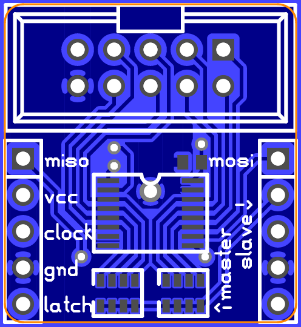

74HC165PW (TSSOP16) PISO shift register augmented breakout
==========================================================

This is a design for an augmented breakout for a 74HC165PW
parallel-in/serial-out 8-bit shift register in a TSSOP-16 package.

Features
--------

*   Decoupling capacitor on board.
*   Pull-up resistors on board for all 8 inputs.
*   10-pin boxed header provides connection to all 8 input pins, plus
    supply and ground.
*   The host-side 5-pin header provides power and serial input to the
    board, while the compatible guest-side 5-pin header provides power
    and serial output to the host-side header of another breakout (or to
    another 74HC165-based or similar assembly).
*   Pre-fab and some-assembly-required options for cables for the header
    connectors are readily available.

Parts list
----------

*   1 x 74HC165PW (TSSOP-16)
*   2 x 5-pin header (100-mil centers)
*   1 x 10-pin boxed header (100-mil centers)
*   1 x 0.1µF capacitor (0603)
*   2 x 10kΩ (nom.) isolated 4-resistor array (0612, aka 0603 x 4)
    *   Other resistances may be more suitable for some applications.
    *   If inputs are already HC-compatible, the resistors may be
        omitted.

License
-------

The schematic and layout are to be used under the terms of the "Expat
License" (aka the OSI-approved "MIT license"), wherein the "Software"
refers to these files. The text follows:

> Copyright © 2016 Peter S. May
>
> Permission is hereby granted, free of charge, to any person obtaining
> a copy of this software and associated documentation files (the
> "Software"), to deal in the Software without restriction, including
> without limitation the rights to use, copy, modify, merge, publish,
> distribute, sublicense, and/or sell copies of the Software, and to
> permit persons to whom the Software is furnished to do so, subject to
> the following conditions:
>
> The above copyright notice and this permission notice shall be
> included in all copies or substantial portions of the Software.
>
> THE SOFTWARE IS PROVIDED "AS IS", WITHOUT WARRANTY OF ANY KIND,
> EXPRESS OR IMPLIED, INCLUDING BUT NOT LIMITED TO THE WARRANTIES OF
> MERCHANTABILITY, FITNESS FOR A PARTICULAR PURPOSE AND NONINFRINGEMENT.
> IN NO EVENT SHALL THE AUTHORS OR COPYRIGHT HOLDERS BE LIABLE FOR ANY
> CLAIM, DAMAGES OR OTHER LIABILITY, WHETHER IN AN ACTION OF CONTRACT,
> TORT OR OTHERWISE, ARISING FROM, OUT OF OR IN CONNECTION WITH THE
> SOFTWARE OR THE USE OR OTHER DEALINGS IN THE SOFTWARE.
